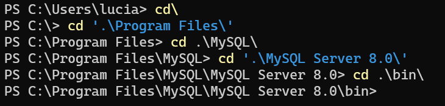

- [MySQL](#mysql)
  - [Como esta organizada una base de datos?](#como-esta-organizada-una-base-de-datos)
  - [**Campos**](#campos)
  - [**Registros**](#registros)
  - [**Indice**](#indice)
  - [**(\*)Clave primaria**](#clave-primaria)
  - [**(\*)Clave Externa (Foranea)**](#clave-externa-foranea)
  - [**Esquemas**](#esquemas)
  - [**View (Vista)**](#view-vista)
  - [**Procedures (Procedimientos)**](#procedures-procedimientos)
  - [**Disparador (Trigger)**](#disparador-trigger)
  - [**Creando base de dato**](#creando-base-de-dato)
  - [**Eliminando una Base de Datos**](#eliminando-una-base-de-datos)
  - [**Conectarnos por consola**](#conectarnos-por-consola)

# MySQL

 

## Como esta organizada una base de datos?

Esta constituidas por diversas entidades.

- `Base de datos`
  - Tabla
    - Columnas (Campos)
    - Filas(Registros)

 

**Tenemos que definir:**

> - Cuantos campos tendremos?

> - Que tipo de datos asignaremos a cada campo?

 

**Tipos de campo:**

> - Texto: `char, varchar, text...`

> - Numerido: `int, bigint, smallint, float, bool...`

> - Fecha: `date, datetime, timestamp...`

**Si no introducimos la informacion de acuerdo con el tipo de campo definido, se genera errores.**

 

## **Campos**

> - Definido al momento de su creacion
>
> - Numero limitado.
>
> - No admite datos que no fueron especificados.

 

## **Registros**

> - Son los datos contenidos en los campos.
> - Numero ilimitado.
>
> - Limite maximo dado por la capacidad de almacenamiento disponible en el disco
>
> - Al momento de la creacion de la base de dato pueden establecer politicas de crecimiento.

 

## **Indice**

Es un numero que nos facilita localizar una serie de registros al interior de mi tabla.

> - Facilita la busqueda de registro(s)

 

## **(\*)Clave primaria**

Es un campo en el cual ninguno de su registro se puede repetir de si mismo.

> - No es obligatorio
> - Su combinacion no se puede repetir en ningun otro registri de la tabla

 

## **(\*)Clave Externa (Foranea)**

La base de dato estan compuesta por muchas tablas y se puede tener varias claves primaria pero para poder **_relacionar_** cada una de mis tablas necesito una `CLAVE EXTERNA`.

> - Campo que relaciona las tablas.
> - Garantiza la integridad de datos.

 

## **Esquemas**

Son la forma de facilitar la organizacin de mi base de datos

> - Facilita la agrupacion de tablas por temas

 

## **View (Vista)**

> - Consultas de _n_ tablas al mismo tiempo.
>
> - Alto costo de procesamiento.

Facilita tomar elemento de varias tablas con diferentes datos especificos.

**Consulta(Query)**

> - Unir tablas a traves de un **_join_**.
>
> - Creamos filtros

 

## **Procedures (Procedimientos)**

> - Logica estructurada con lenguaje nativo del mismo SQL `(if, while, for...)`
>
> - Podemos crear funciones:

    IF a > 0 THEN
    X= y + z
    z+ INSTR (z + 1)
    SELECT * FROM alpha
    PUT alpha IN TABLE x

 

## **Disparador (Trigger)**

> - Avisos automaticos cuando hay algun tipo de cambio en la base de datos o en la tabla.
>
> - Ejecuta una funcion o procedimiento cuando la condicion del trigger es satisfecha.

   

## **Creando base de dato**

    CREATE {DATABASE | SCHEMA} [IF NOT EXISTS] db_name
        [create_option]

    create_option: [DEFAULT] {
        CHARACTER SET [=] charset_name
       |COLLATE [=] collation_name
       |ENCRYPTION[=] {'Y' | 'N'}
    }

 

## **Eliminando una Base de Datos**

    DROP {DATABASE | SCHEMA} [IF EXISTS] db_name

   

## **Conectarnos por consola**

Entramos al directorio donde esta MySQL guardado.

Despues dentro de la carpeta `bin` ejecutamos el siguiente comando y para poder inicializar nos pedira el password.

   

**Lo que aprendimos en esta aula:**

- A acceder y navegar por Workbench.

- A crear una base de datos por líneas de comando en SQL o por el asistente.

- A borrar una base de datos por líneas de comando en SQL o por el asistente.

- A acceder a una tabla por líneas de comando o por el asistente.
